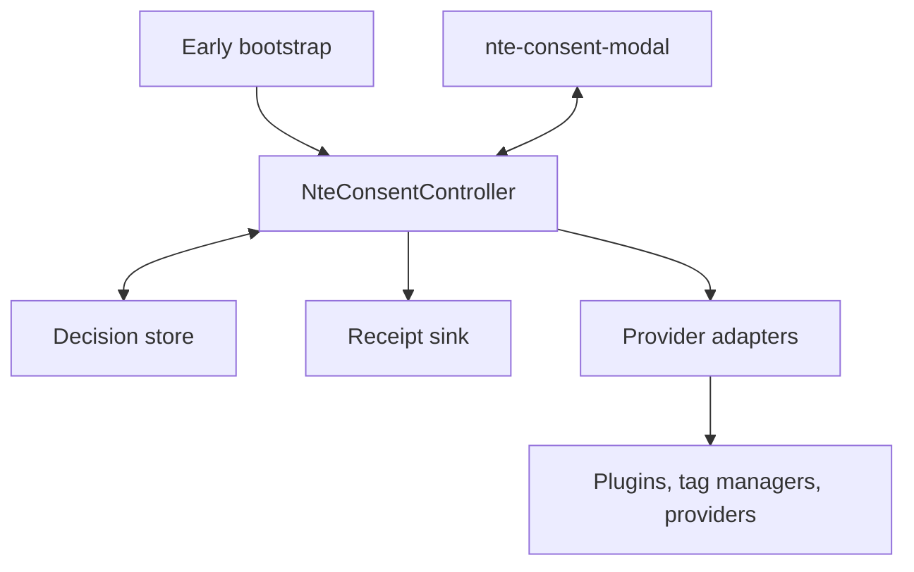
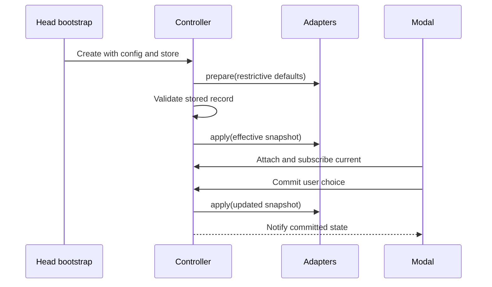

# Proposal: NTE Consent Modal

- Status: Proposed
- Package: `@nextrap/nte-consent-modal`
- Element: `<nte-consent-modal>`
- Runtime base: `nextrap_element`
- UI foundation: `@nextrap/nte-dialog`
- Audience: Nextrap maintainers and application integrators

## Decision summary

Add a purpose-oriented consent component that separates four responsibilities:

1. `<nte-consent-modal>` renders the accessible first layer and preference view.
2. `NteConsentController` owns the canonical consent state and decisions.
3. A versioned store persists the local decision; an optional receipt sink records evidence independently.
4. Explicit provider adapters translate purpose decisions into project callbacks, tag-manager events, or provider-native consent signals.

The element extends `nextrap_element` and composes `nte-dialog`; it does not subclass the dialog. The package also exposes a head-safe bootstrap entry that can establish restrictive defaults before analytics or advertising code starts. This timing boundary is essential: a modal connected after document parsing cannot retroactively prevent earlier provider activity.

The proposed MVP is a consent-management building block, not a certified CMP. It deliberately does not generate IAB TCF or GPP strings, discover scripts, geolocate users, or make legal decisions for an application.

## Problem

Nextrap applications need a consistent way to:

- ask for advertising, analytics, personalization, and other optional purposes;
- offer equally understandable accept, reject, and configure paths;
- persist a versioned choice and ask again when the policy materially changes;
- expose the current state reliably to application plugins and third-party providers;
- apply restrictive defaults before optional providers initialize;
- update consent during an SPA session and across tabs;
- let users revisit or withdraw a choice;
- support provider-native mechanisms such as Google Consent Mode without coupling the UI to one vendor.

A dialog alone solves only presentation. A useful component also needs a state contract, early initialization, persistence, downstream synchronization, and explicit failure behavior.

## Research findings

### Open-source projects

| Project | Useful pattern | Lesson for Nextrap |
| --- | --- | --- |
| [vanilla-cookieconsent](https://github.com/orestbida/cookieconsent) | Categories, services, lifecycle events, and policy revision management | Use categories/purposes as the stable decision surface and treat policy revision as first-class state. |
| [Klaro](https://github.com/kiprotect/klaro) | Services declare purposes and callbacks | Keep provider integration declarative, but execute it through typed adapters rather than UI callbacks. |
| [tarteaucitron.js](https://github.com/AmauriC/tarteaucitron.js) | Large catalog of service-specific integrations | A reusable adapter contract scales better than hard-coding vendor behavior in the component. |
| [Orejime](https://github.com/boscop-fr/orejime) | Purpose-oriented consent and accessibility-conscious UI | Present human purposes first and disclose the services that depend on them. |
| [c15t](https://github.com/c15t/c15t) | Headless/reactive consent state and SPA-oriented architecture | Separate state from rendering and provide subscription APIs that immediately emit the current snapshot. |

The recommendation is to adopt these architectural patterns, not one of these runtimes as a dependency. Nextrap needs a small web-component API, its own theming contract, and deterministic integration with existing packages.

### Commercial CMPs

| Product | Useful pattern | Lesson for Nextrap |
| --- | --- | --- |
| [OneTrust](https://developer.onetrust.com/onetrust/docs/javascript-events-guide) | Immediate state events plus separate consent-receipt workflows | Downstream updates must not wait for remote evidence logging. |
| [Usercentrics](https://docs.usercentrics.com/cmp_browser_sdk/) | Headless browser SDK and service-level metadata | Keep the controller usable without the modal and model services separately from purposes. |
| [Cookiebot](https://support.cookiebot.com/hc/en-us/articles/360009074960-Automatic-cookie-blocking) | Early bootstrap and multiple integration modes | Timing is part of the API; explicit integration remains the predictable default. |
| [consentmanager](https://www.consentmanager.net/en/help/developer-reference/automatic-blocking-of-codes-and-cookies/) | Automatic, semi-automatic, and manual integration options | Core behavior should be explicit and testable; convenience automation can be a separate concern. |
| [Didomi](https://developers.didomi.io/cmp/web-sdk/third-parties) | Separation of provider loading, native signals, tag managers, and protocols | Model these as adapter modes rather than pretending all providers behave alike. |
| [Sourcepoint](https://docs.sourcepoint.com/hc/en-us/articles/42043114660755-Overview-Manage-3rd-party-tags-web) | Explicit tag gating and protocol-specific integration | Avoid a generic promise that arbitrary third-party code can be managed safely without configuration. |

The common architecture is a headless state engine plus policy, UI, storage, evidence, and provider layers. Scanning, geolocation, cross-domain synchronization, and regulatory protocol operation are generally services around that core, not modal responsibilities.

## Goals

- Provide an accessible consent modal and persistent preference entry point.
- Run on `nextrap_element` and reuse the existing dialog/window behavior through composition.
- Expose a stable, typed, provider-neutral consent model.
- Make the effective state available before and after the component connects.
- Default optional purposes to a non-permissive state.
- Support first choice, later changes, withdrawal, expiry, and policy revisions.
- Support static pages, SSR, CMS output, SPAs, and tag-manager-based projects.
- Provide deterministic plugin/provider integration with observable errors.
- Keep protocol-specific and vendor-specific code tree-shakeable.

## Non-goals

- Legal advice or automatic selection of a lawful basis.
- Region detection or IP geolocation.
- A vendor database or automatic classification of arbitrary scripts/cookies.
- Generation or interpretation of IAB TCF or GPP strings.
- Claiming Google CMP certification or other regulatory/vendor certification.
- A consent-receipt backend, admin UI, policy authoring UI, or audit dashboard.
- Anonymous cross-domain consent synchronization.
- Reversing data already transmitted before withdrawal.
- A general banner, toast, paywall, or subscription wall.

## Product principles

### Purpose decisions, service disclosure

Users decide at the purpose level. Services/providers are disclosed beneath each purpose so that an application can explain who receives data and why. In the MVP, services are not individually toggleable; that would make semantics, dependencies, and proof of consent significantly more complex.

Typical purposes are application-defined:

| Example purpose | Default | Example services |
| --- | --- | --- |
| `essential` | Required | Session security, consent storage |
| `functionality` | Optional | Embedded media, preference features |
| `analytics` | Optional | Matomo, Google Analytics |
| `advertising` | Optional | Google Ads, Microsoft Advertising |
| `personalization` | Optional | Content or ad personalization |

The component does not ship legal wording or assume that these examples are correct for every site.

### Fail closed, represent unknown accurately

`unknown` and `denied` are distinct states. Both prevent optional activation, but they mean different things for UI, evidence, and provider protocols. Missing, corrupt, expired, or stale records resolve to `unknown`, never to an implicit grant.

### One canonical writer

The controller is the canonical application consent state. For each downstream provider or protocol, exactly one adapter must write consent signals. Mixing a tag-manager template, inline provider commands, and an NTE adapter for the same provider creates ordering bugs and contradictory state.

### Consent state is not a provider signal

A provider-native signal communicates the application decision to that provider; it does not establish that provider code may be loaded. Each integration must declare whether it:

- gates provider startup (`hard-gate`);
- initializes a provider in a restricted mode and updates its native signal (`native-signal`); or
- delegates to a separately operated protocol/CMP (`external-protocol`).

## Proposed package architecture



### Package exports

```json
{
  "exports": {
    ".": "./dist/index.js",
    "./bootstrap": "./dist/bootstrap.js",
    "./adapters": "./dist/adapters/index.js",
    "./adapters/google-consent-mode": "./dist/adapters/google-consent-mode.js"
  }
}
```

- The root registers/exports the element, controller, types, default store, and generic callback adapter.
- `./bootstrap` has no Lit or custom-element registration side effects. A host bundles or inlines it before measurement/advertising startup.
- Provider adapters are separate entry points so an application does not ship vendors it does not use.
- A second core package should be considered only when a second independent consumer proves the extraction useful.

### Runtime dependencies

- `@nextrap/nte-element`
- `@nextrap/nte-dialog`
- the same Lit/runtime primitives already accepted by NTE packages

No commercial CMP, provider SDK, geolocation service, or policy engine becomes a runtime dependency.

## Public element API

The element extends the repository-standard `nextrap_element` base (with slot visibility support) and renders an inner `<nte-dialog>`. Composition keeps the consent state independent of window presentation and avoids inheriting private dialog structure.

### Attributes and properties

| Attribute | Property | Type | Default | Meaning |
| --- | --- | --- | --- | --- |
| `prompt` | `prompt` | `'auto' \| 'manual'` | `'auto'` | Automatically open when a valid choice is required, or wait for the host. |
| `initial-view` | `initialView` | `'summary' \| 'preferences'` | `'summary'` | First view shown when opened. |
| `anchor` | `anchor` | dialog anchor value | dialog default | Delegates placement to `nte-dialog`. |
| `require-decision` | `requireDecision` | `boolean` | `false` | Prevent dismissing the initial prompt without a decision; never converts dismissal into consent. |
| `locale` | `locale` | `string` | document language | Selects host-provided messages and is stored as decision context. |
| — | `config` | `NteConsentConfig` | required | Purposes, services, policy revision, expiry, messages, and policy context. |
| — | `controller` | `NteConsentController` | package default | Allows a head-created or application-owned controller to be attached. |
| — | `messages` | `NteConsentMessages` | built-in English fallback | UI labels; applications must provide reviewed policy text. |
| — | `open` | `boolean` (read-only) | `false` | Reflects presentation state, not consent state. |

Complex configuration is a property rather than JSON embedded in an attribute. CMS/static integrations may assign the property from their small initialization script or use a project wrapper with a preconfigured controller.

### Methods

```ts
interface NteConsentModalElement extends HTMLElement {
  showSummary(): void;
  showPreferences(): void;
  close(reason?: 'dismiss' | 'saved' | 'external'): void;
}
```

Decision methods live on the controller, not on the view element.

### Slots

| Slot | Purpose |
| --- | --- |
| `launcher` | Persistent control that reopens preferences after an initial choice. |
| `title` | Optional heading override. |
| `intro` | Optional first-layer explanatory content. |
| `privacy-link` | Link to the application's privacy/cookie information. |
| `footer` | Optional policy/company content after the owned actions. |

Accept, reject, configure, and save controls remain component-owned. This preserves event semantics, accessibility, and action ordering; labels are customizable through `messages`.

### Events

All events bubble and are composed. They are notifications, not the primary state API; `subscribe(..., { emitCurrent: true })` prevents listeners from missing early state.

| Event | Detail | When |
| --- | --- | --- |
| `consent-ready` | `{ snapshot }` | Store and policy resolution completed. |
| `consent-first-choice` | `{ previous, current }` | First explicit decision is committed. |
| `consent-change` | `{ previous, current, changedPurposes }` | Any committed decision changes. |
| `consent-policy-stale` | `{ record, config }` | Stored policy revision/fingerprint no longer matches. |
| `consent-receipt` | `{ decisionId, status }` | Optional evidence write succeeds or fails. |
| `consent-error` | `{ phase, error, recoverable }` | Store, policy, adapter, or receipt operation fails. |
| `opened` | `{ view }` | Modal opens. |
| `closed` | `{ reason }` | Modal closes without implying a choice. |

### CSS parts

The element exports stable parts for external Sass/theming:

- `dialog`, `dialog-header`, `dialog-content`, `dialog-footer`, `dialog-close-button` (aliased from the inner dialog);
- `summary`, `preferences`, `purpose-list`, `purpose`, `purpose-control`, `service-list`;
- `actions`, `reject-button`, `configure-button`, `accept-button`, `save-button`, `launcher`.

Shadow CSS contains only functional layout and accessibility rules. The package supplies a `.style-default` Sass layer consistent with the repository. This proposal introduces no component-specific CSS custom properties; any additions require a separate theming review.

## Controller and data contracts

### Configuration

```ts
type ConsentValue = 'unknown' | 'required' | 'granted' | 'denied' | 'not-applicable';

interface NteConsentPurpose {
  id: string;
  title: string;
  description: string;
  required?: boolean;
}

interface NteConsentService {
  id: string;
  title: string;
  description?: string;
  purposes: string[];
  privacyUrl?: string;
  retention?: string;
  dataRecipients?: string[];
}

interface NteConsentConfig {
  policyId: string;
  policyRevision: string;
  purposes: NteConsentPurpose[];
  services?: NteConsentService[];
  expiresAfterDays?: number;
  locale?: string;
  jurisdiction?: string;
  messages?: Partial<NteConsentMessages>;
}
```

IDs are stable machine identifiers. Changing wording alone may retain the revision; changing purposes, service mappings, or material disclosure should advance it. The controller also derives a deterministic policy fingerprint so accidental config drift can be detected.

### Persisted decision

```ts
interface NteConsentRecord {
  schemaVersion: 1;
  decisionId: string;
  policyId: string;
  policyRevision: string;
  policyFingerprint: string;
  choices: Record<string, ConsentValue>;
  decidedAt: string;
  expiresAt?: string;
  source: 'first-layer' | 'preferences' | 'api' | 'migration';
  locale?: string;
  jurisdiction?: string;
}
```

No provider identifiers, page history, fingerprinting data, or free-form personal data are stored in the default record.

### Controller

```ts
interface NteConsentController {
  initialize(): Promise<NteConsentSnapshot>;
  snapshot(): NteConsentSnapshot;
  getChoice(purposeId: string): ConsentValue;
  isServiceAllowed(serviceId: string): boolean;
  acceptAll(source?: NteConsentSource): Promise<NteConsentSnapshot>;
  rejectAll(source?: NteConsentSource): Promise<NteConsentSnapshot>;
  save(choices: Record<string, boolean>, source?: NteConsentSource): Promise<NteConsentSnapshot>;
  withdrawAll(source?: NteConsentSource): Promise<NteConsentSnapshot>;
  registerAdapter(adapter: NteConsentAdapter): () => void;
  subscribe(listener: ConsentListener, options?: { emitCurrent?: boolean }): () => void;
  whenAllowed(serviceId: string, options?: { signal?: AbortSignal }): Promise<void>;
}
```

`whenAllowed` resolves only for the current session and must reject/abort when the supplied signal is aborted. It is a convenience for lazy loading, not a substitute for responding to later withdrawal.

### Runtime phases

```ts
type ConsentPhase =
  | 'initializing'
  | 'prompt-required'
  | 'ready'
  | 'saving'
  | 'error';
```

Required purposes always resolve to `required`. Optional purposes become `granted` only from a valid stored record or an explicit current action.

## Storage and evidence

```ts
interface NteConsentStore {
  load(): NteConsentRecord | null | Promise<NteConsentRecord | null>;
  save(record: NteConsentRecord): void | Promise<void>;
  clear(): void | Promise<void>;
  subscribe?(listener: () => void): () => void;
}

interface NteConsentReceiptSink {
  write(receipt: NteConsentReceipt): Promise<void>;
}
```

Recommended default: a compact first-party cookie store because it is readable during head bootstrap and SSR. It should default to host-only, `Path=/`, `SameSite=Lax`, and `Secure` on HTTPS; domain widening is opt-in. A local-storage adapter is also useful for client-only applications. Neither storage mechanism attempts cross-site sharing.

The local commit and provider update are not blocked on a remote receipt. Receipt failure emits `consent-receipt`/`consent-error` and can be retried by the host. This avoids leaving the UI and active providers in an indeterminate state because an audit endpoint is unavailable.

The default controller coordinates concurrent tabs through the store subscription (`storage` event for local storage or an optional `BroadcastChannel` notification for cookies). A received decision is validated against the same policy before it is applied.

## Provider and plugin integration

### Adapter contract

```ts
type ConsentAdapterMode = 'hard-gate' | 'native-signal' | 'external-protocol';

interface NteConsentAdapter {
  readonly id: string;
  readonly mode: ConsentAdapterMode;
  prepare(context: NteConsentAdapterContext): void;
  apply(
    current: NteConsentSnapshot,
    previous?: NteConsentSnapshot
  ): void | NteConsentApplyResult | Promise<void | NteConsentApplyResult>;
  dispose?(): void | Promise<void>;
}

interface NteConsentApplyResult {
  reloadRequired?: boolean;
  reason?: string;
}
```

- `prepare` is synchronous, idempotent, and establishes the adapter's restrictive initial state before provider startup.
- `apply` is idempotent and receives both snapshots so it can handle grant and withdrawal.
- Adapter failures do not change the stored user decision. They are recorded in controller status and surfaced through `consent-error`.
- If a provider cannot be fully stopped after withdrawal, the result marks `reloadRequired`; the UI can explain this and the host can offer a reload.

### Generic project plugin

The root package includes a callback adapter for first-party features:

```ts
controller.registerAdapter(callbackAdapter({
  id: 'project-analytics',
  mode: 'hard-gate',
  services: ['project-analytics'],
  onGrant: () => analytics.start(),
  onWithdraw: () => analytics.stop()
}));
```

Callbacks run only after the controller validates a committed state. The adapter remembers activation to avoid duplicate initialization during SPA navigation.

### Tag manager

A generic data-layer adapter pushes namespaced snapshots:

```js
window.dataLayer.push({
  event: 'nte_consent_update',
  nteConsent: {
    revision: '2026-08',
    purposes: { analytics: 'denied', advertising: 'granted' }
  }
});
```

Tags use explicit trigger conditions per purpose. The host must not also configure another writer for the same provider consent commands.

### Google Consent Mode v2

[Google Consent Mode](https://developers.google.com/tag-platform/security/concepts/consent-mode) uses provider-specific signals rather than the application's purpose names. The adapter maps explicitly:

| Google signal | Typical NTE purpose mapping |
| --- | --- |
| `analytics_storage` | `analytics` |
| `ad_storage` | `advertising` |
| `ad_user_data` | `advertising` |
| `ad_personalization` | `advertising` and, if configured separately, `personalization` |
| `functionality_storage` | `functionality` |
| `personalization_storage` | `personalization` |
| `security_storage` | configured required/security purpose |

The adapter sends a restrictive `default` before Google configuration/events and an `update` on the same page when a decision becomes available, matching Google's [implementation guide](https://developers.google.com/tag-platform/security/guides/consent). Mapping is application configuration, not hard-coded legal logic.

Two documented modes are supported:

| Mode | Before optional grant | Trade-off |
| --- | --- | --- |
| Basic | Google tags are not loaded/fired | Strongest deterministic gating; no pre-consent measurement. |
| Advanced | Tags initialize with denied defaults and may send cookieless pings | More measurement/modeling, but denied does not mean no network request. |

Advanced mode must be explicitly selected. Options such as URL passthrough or ads-data redaction are also explicit, reviewable configuration and never silently enabled.

For Google publisher products in the EEA, UK, or Switzerland, Google requires a [certified CMP](https://support.google.com/admanager/answer/13554116?hl=en) integrated with the IAB TCF. This component by itself does not satisfy that program. An application in that scope must delegate the external protocol to an appropriate CMP rather than generating strings locally.

### Other providers

The MVP should ship the generic callback/data-layer adapters and Google Consent Mode adapter. Microsoft UET, Matomo, and other providers can be documented recipes or later isolated adapters after their revocation behavior and test harnesses are reviewed. For example, Matomo exposes separate [tracking- and cookie-consent APIs](https://developer.matomo.org/guides/tracking-consent); an adapter must choose the correct one rather than treating them as interchangeable.

## Early bootstrap and integration modes

### Recommended sequence



The host bundles or inlines `@nextrap/nte-consent-modal/bootstrap` before any optional provider/tag-manager bootstrap. It then assigns the same controller to the element:

```ts
// Built into an early head asset or an application-owned inline bundle.
import { bootstrapConsent } from '@nextrap/nte-consent-modal/bootstrap';

const consent = bootstrapConsent(config, { store, adapters });
window.appConsent = consent;
```

```ts
// Later, after custom elements are registered.
document.querySelector('nte-consent-modal').controller = window.appConsent;
```

The package does not require the global; it is shown only as a simple hand-off. Framework applications should inject the controller through their own module/container.

### Integration options

| Host type | Recommended integration |
| --- | --- |
| Static/CMS | Small early bundle creates controller; markup includes element and launcher. |
| SSR | Server reads/verifies the first-party decision record, injects an initial snapshot, and still lets the client validate it. |
| SPA | Application singleton controller; one modal near the app shell; adapters survive route changes. |
| Tag manager | Restrictive defaults before the container; namespaced data-layer updates; explicit tag triggers. |
| Existing external CMP | Use `external-protocol` adapter as a read/sync boundary only if ownership and source of truth are explicitly defined. |

## Policy context, GPC, and regulatory protocols

The core accepts an optional policy resolver that can use server-supplied context (for example jurisdiction or site policy) to determine whether prompting is required and which purposes apply. It does not call a geolocation service.

[Global Privacy Control](https://www.w3.org/TR/gpc/) is a positive opt-out signal (`Sec-GPC: 1` or `navigator.globalPrivacyControl === true`), not a general consent grant. An optional resolver can force relevant sale/sharing or cross-context advertising purposes to denied and keep them disabled in the UI. Absence of GPC never becomes consent. Server handling is needed when relevant processing happens before client JavaScript.

IAB TCF and GPP are external protocol integrations. The TCF has registered-CMP, vendor-list, UI, and version obligations; GPP contains jurisdiction-specific sections. The MVP neither synthesizes these strings nor exposes protocol APIs that could be mistaken for compliant implementations.

## UX behavior

### First layer

- Clear purpose summary and link to detailed information.
- Visible `Reject optional`, `Configure`, and `Accept all` actions with equivalent visual prominence where the application policy requires this baseline.
- No optional purpose preselected.
- Closing, scrolling, navigating, or pressing Escape never means consent.
- If `require-decision` is enabled, the inner dialog is non-dismissible until an explicit choice; required functionality still must remain usable according to the host's policy.

### Preferences

- One control per optional purpose.
- Required purposes are explained and visibly fixed, not disguised as enabled optional toggles.
- Services, recipients, privacy links, and retention text are disclosed under their mapped purposes.
- `Save selection`, `Reject optional`, and `Accept all` remain available.
- Returning from preferences to summary retains the draft but does not apply it until committed.

### Revisit and withdrawal

- A persistent `launcher` slot or host control reopens the preferences.
- Withdrawal is applied to adapters before UI success is announced.
- If cleanup cannot be guaranteed, the UI reports that reload is required.
- A new policy revision invalidates the old optional grants and opens the prompt according to `prompt` behavior.

The design follows the GDPR requirement that withdrawal be as easy as giving consent ([Article 7](https://eur-lex.europa.eu/legal-content/EN/TXT/HTML/?uri=CELEX%3A02016R0679-20160504)) and avoids manipulative choice presentation highlighted by regulators such as the [CNIL](https://www.cnil.fr/en/dark-patterns-cookie-banners-cnil-issues-formal-notice-website-publishers). Applications remain responsible for reviewed wording and jurisdiction-specific behavior.

## Accessibility

- Use the inner native `<dialog>` lifecycle for modal focus, Escape behavior, and focus restoration.
- Give each view a stable accessible name and description.
- Render purpose choices as native checkboxes/switches with labels and descriptions; required purposes are announced as required and read-only.
- Keep DOM order and visual action order consistent.
- Move focus to the preferences heading when changing views.
- Announce save failures and reload requirements through a polite live region.
- Preserve keyboard access at narrow and zoomed layouts.
- Test with automated accessibility checks plus keyboard and screen-reader smoke tests.

The current dialog API needs a public accessible-name/description forwarding contract for its internal native dialog. Before implementing the modal, maintainers should approve a small generic dialog enhancement (for example label/description properties or an internal `aria-labelledby`/`aria-describedby` contract). The consent package must not reach into another component's shadow root.

## Responsive and visual behavior

- Desktop/tablet: centered dialog with constrained readable width and scrollable content region.
- Narrow viewport: edge-to-edge/full-height sheet while retaining native modal semantics.
- Actions wrap or stack without changing semantic order.
- Purpose/service disclosure uses progressive expansion, but action controls never disappear behind an unlabeled accordion.
- Host projects theme with exported parts and the Sass layer; functional component CSS remains minimal.

## Failure and privacy behavior

| Failure | Required behavior |
| --- | --- |
| Store unavailable/corrupt | Resolve optional purposes to `unknown`, prepare restrictive providers, show prompt, emit recoverable error. |
| Policy resolver unavailable | Use configured conservative policy; do not infer a permissive jurisdiction. |
| Adapter `prepare` fails | Do not start the affected provider; report adapter and phase. |
| Adapter update fails | Keep the user's recorded decision, expose degraded sync, and allow retry/reload. |
| Receipt endpoint fails | Keep local decision/provider state; queue or delegate retry to host. |
| Unknown purpose/service ID | Reject config in development and fail closed in production. |
| Duplicate adapter writer | Warn/fail registration for the same declared provider/protocol key. |

Logs must not include the full record by default. Errors identify component, phase, adapter/store ID, and decision ID only when explicitly enabled for diagnostics.

## Security considerations

- Validate stored data against schema, policy ID, revision, fingerprint, timestamps, and configured purpose IDs.
- Treat all slotted content and provider metadata as host-owned DOM/text; do not render untrusted HTML strings.
- Do not dynamically execute script text from configuration.
- Keep adapter loading explicit so a malicious config cannot import arbitrary URLs.
- Document cookie integrity limits: a client-writable cookie is state, not tamper-proof evidence. Servers making sensitive decisions need their own signed/session-bound representation.

## Proposed implementation slices

1. Approve this proposal and resolve the open API/storage/accessibility decisions.
2. Add the generic accessible-name contract to `nte-dialog` as a separately reviewed prerequisite.
3. Add `@nextrap/nte-consent-modal` with types, config validation, controller, cookie/local-storage stores, and tests.
4. Add the element, functional shadow styles, `.style-default` Sass layer, responsive behavior, and accessibility tests.
5. Add head bootstrap, generic callback/data-layer adapters, and an example static/SPA integration.
6. Add and test Google Consent Mode Basic/Advanced adapter as a separate entry point.
7. Add usage and theming skill documentation required by the repository workflow.

Each slice should remain reviewable; runtime implementation starts only after proposal approval.

## Testing strategy

### Unit

- schema/config validation and deterministic policy fingerprint;
- expired, corrupt, missing, matching, and stale records;
- all transitions among unknown/granted/denied/required states;
- idempotent adapter prepare/apply and duplicate-writer detection;
- revision changes, withdrawal, and receipt failure;
- cookie and local-storage serialization, multi-tab notifications, and migrations.

### Component

- auto/manual prompting and summary/preferences navigation;
- focus entry, restoration, Escape/dismiss policy, and keyboard-only completion;
- no decision on close;
- event bubbling/composition and exact event ordering;
- narrow viewport, zoom, long translations, and service disclosure;
- axe-equivalent automated checks plus manual screen-reader smoke tests.

### Integration

- restrictive bootstrap runs before test provider startup;
- Basic mode creates no provider request before grant in a controlled browser test;
- Advanced mode sends denied defaults before provider config and updates on choice;
- SPA navigation does not duplicate provider initialization;
- withdrawal stops/updates providers and reports reload where required;
- SSR hydration and cross-tab changes converge on one validated snapshot.

## Acceptance criteria

- `<nte-consent-modal>` is implemented on `nextrap_element` and composes `nte-dialog` through public APIs only.
- Optional purposes are never granted by default, by dismissal, or by invalid/stale storage.
- Reject, configure, and accept paths are keyboard accessible and do not rely on color alone.
- A permanent preferences entry can be provided through the launcher contract.
- The head bootstrap can set restrictive adapter defaults before provider initialization.
- Controller subscriptions can immediately emit current state and remain stable across SPA navigation.
- Store records are schema- and policy-versioned, expire predictably, and synchronize supported tabs.
- Provider adapters are explicit, idempotent, tree-shakeable, and process withdrawal.
- Google Basic and Advanced semantics are distinguished in API, docs, and tests.
- TCF/GPP strings, geolocation, scanning, and certification claims are absent from the MVP.
- Storage, adapter, and receipt failures fail closed and surface observable errors.
- Public methods, attributes/properties, slots, events, CSS parts, and integration recipes are documented.
- The package contains usage/theming guidance required by the repository conventions.

## Open questions for review

1. Should the first-party cookie store be the default, or should all applications choose a store explicitly?
2. Is `require-decision` an acceptable generic API, or should dismissibility be determined only by the host policy resolver?
3. Should purpose/service configuration support only JavaScript properties in v1, or also a validated declarative JSON child for CMS-heavy projects?
4. Which accessible-name/description API should be added to `nte-dialog`?
5. Should the data-layer adapter be included in the root entry or remain an optional subpath export?
6. Is Google Consent Mode part of the initial package release or a follow-up after the provider-neutral core is proven?
7. Which receipt fields, if any, should be standardized before a real evidence backend exists?

## Rejected alternatives

### Put all logic in the custom element

Rejected because component connection is too late for early provider defaults, UI remounting would risk state loss, and non-visual consumers need the same state.

### Subclass the dialog/window

Rejected because consent state is not window behavior. Composition preserves replaceable presentation and the dialog's encapsulation.

### Make service toggles the primary model

Rejected for v1 because users should decide understandable purposes and because per-service dependencies produce contradictory combinations. Services remain visible disclosures and adapter targets.

### Automatically enable every provider after an accept-all event

Rejected because providers differ in startup, restricted modes, revocation, and protocol ownership. Explicit adapters are testable and auditable.

### Implement TCF/GPP locally in the MVP

Rejected because these are evolving external protocols with registration, vendor-list, jurisdiction, UI, and operational obligations. They belong behind an explicit external-protocol boundary.

### Persist only booleans

Rejected because booleans cannot distinguish no decision, required processing, non-applicability, expiry, policy revision, or evidence context.

## References

- [Google: Consent Mode overview](https://developers.google.com/tag-platform/security/concepts/consent-mode)
- [Google: Set up consent mode](https://developers.google.com/tag-platform/security/guides/consent)
- [Google: CMP requirements for publishers](https://support.google.com/admanager/answer/13554116?hl=en)
- [IAB Europe: Transparency & Consent Framework](https://iabeurope.eu/transparency-consent-framework/)
- [W3C: Global Privacy Control](https://www.w3.org/TR/gpc/)
- [GDPR Article 7](https://eur-lex.europa.eu/legal-content/EN/TXT/HTML/?uri=CELEX%3A02016R0679-20160504)
- [CNIL: dark patterns in cookie banners](https://www.cnil.fr/en/dark-patterns-cookie-banners-cnil-issues-formal-notice-website-publishers)
- Open-source and commercial product references linked in the research tables above.
