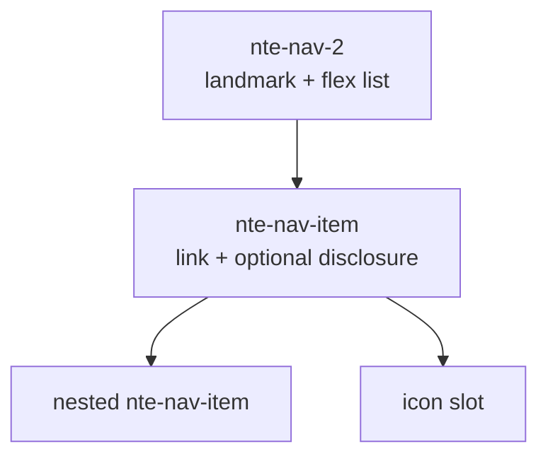

# `@nextrap/nte-nav-2` API draft

Status: working prototype, not a migration commitment.

## Scope

`nte-nav-2` isolates the navigation-list responsibility currently mixed into `@nextrap/nte-nav`. The legacy package continues to run. Navbar, sticky positioning, brand layout, burger/offcanvas transfer and the eventual rename from `nte-nav-2` to `nte-nav` are separate follow-up work.



## Proposed author API

```html
<nte-nav-2 aria-label="Hauptnavigation">
  <nte-nav-item href="/leistungen">
    <svg slot="icon" aria-hidden="true"><!-- … --></svg>
    Leistungen
    <nte-nav-item href="/leistungen/beratung">Beratung</nte-nav-item>
    <nte-nav-item href="/leistungen/entwicklung">Entwicklung</nte-nav-item>
  </nte-nav-item>
  <nte-nav-item href="/ueber-uns" current="page">Über uns</nte-nav-item>
</nte-nav-2>
```

The component host tree contains only meaningful component nodes and label/icon content. Each `nte-nav-item` renders its real `a[href]`, optional disclosure button and popover submenu inside its Shadow DOM. Nested items are auto-assigned to an internal named slot.

## Styling contract

Orientation and responsive behavior are deliberately not attributes. They are CSS decisions so the same markup can react to its placement:

```scss
@use '@nextrap/nte-nav-2' as nav;

.site-header nte-nav-2.style-default {
  @include nav.main-navigation();
  @include nav.responsive(48rem);
}

.sidebar nte-nav-2.style-default {
  @include nav.sub-navigation();
  @include nav.vertical();
}
```

The mixins set inherited custom properties. Shadow DOM CSS consumes them for flex direction, spacing, popover placement and transitions. Visual rules target exported parts. `style-default`, `style-*` and `with-*` naming follows the repository contract.

## CSS/no-custom-JS submenu decision

Pure `:hover` or `:focus-within` visibility is useful as progressive visual enhancement, but it is not the durable interaction state: touch toggle behavior, Escape/light-dismiss, focus return and an exposed expanded state cannot all be provided by those selectors alone.

The prototype therefore uses native HTML Popover invokers:

```html
<a href="/leistungen">Leistungen</a>
<button popovertarget="submenu">…</button>
<div id="submenu" popover="auto">…</div>
```

There is no component-authored click/outside/Escape state machine. The browser owns the open state; CSS uses `:popover-open`, `position-area`, `position-try-fallbacks`, transitions and `prefers-reduced-motion` entirely inside the item Shadow DOM.

This follows the platform examples and guidance:

- [HTML Standard: popover sub-navigation example](https://html.spec.whatwg.org/multipage/popover.html#the-popover-attribute)
- [CSS Anchor Positioning: Popover API implicit anchor](https://www.w3.org/TR/css-anchor-position-1/)
- [WAI-ARIA APG: disclosure navigation with top-level links](https://www.w3.org/WAI/ARIA/apg/patterns/disclosure/examples/disclosure-navigation-hybrid/)
- [WAI-ARIA APG: why typical site navigation should not use menubar](https://www.w3.org/WAI/ARIA/apg/patterns/menubar/examples/menubar-navigation/)

## Accessibility baseline

- Internal `nav` landmark with a forwarded accessible label.
- `role="list"` / `role="listitem"` hierarchy instead of application-menu roles.
- Native anchors with `href`, `target`, `rel`, `download` and `aria-current` forwarding.
- Separate link and disclosure controls when a parent page and its child pages are both valid destinations.
- Native Enter/Space activation, Escape close, light dismiss and focus restoration from Popover.
- Visible `:focus-visible` states and reduced-motion handling.
- DOM order remains the source of reading and focus order. `order` is exposed but documented as unsuitable for semantic reordering.

Before a stable release, test the composed Shadow DOM accessibility tree with NVDA/Firefox, JAWS/Chrome, VoiceOver/Safari and mobile screen readers; APG explicitly recommends real assistive-technology testing.

## Useful follow-up API candidates

| Candidate | Recommendation | Reason |
|---|---|---|
| `disabled` item state | Defer | Disabled links are usually better represented by omission or plain text; semantics need a concrete product case. |
| Router adapter / SPA activation event | Defer | Native links should remain the baseline; an adapter can layer on later. |
| `showSubmenu()`, `hideSubmenu()` | Defer | Add only when a real integration needs imperative control. |
| Optional arrow/Home/End keys | Defer | APG treats these as optional for disclosure navigation; Tab order is the simpler baseline. |
| `open-on-hover` | Reject as default | Hover is unavailable on touch and must never replace explicit disclosure activation. |
| Popover/anchor legacy fallback | Decide before stable release | It depends on the supported browser matrix and may require a small positioning controller. |
| `nte-navbar` replacement | Separate package/phase | Navbar owns layout, sticky behavior and brand regions, not navigation semantics. |

## Migration outline

1. Validate this package in real header and sidebar contexts without touching `@nextrap/nte-nav`.
2. Stabilize item attributes, parts and mixins after accessibility/browser testing.
3. Implement a separate Navbar replacement that composes the stable nav component.
4. Publish a migration mapping from legacy `ul/li/ul` markup to `nte-nav-item` markup.
5. Only then plan the final package/tag rename.
