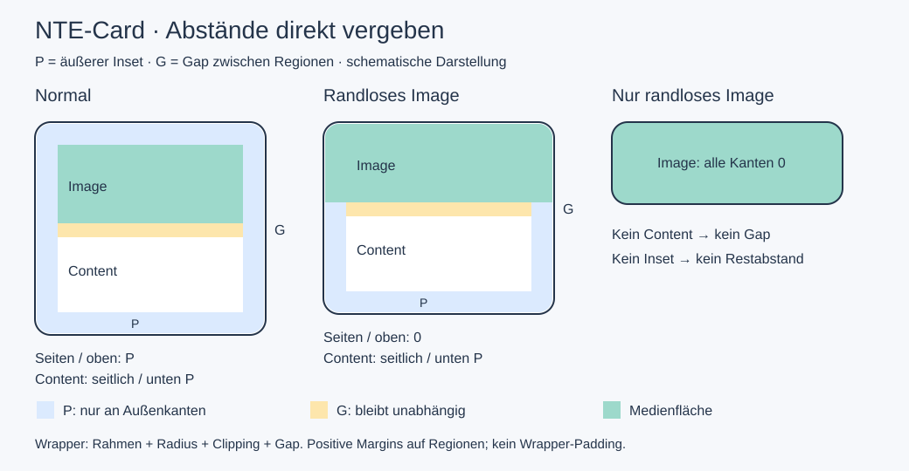

# @nextrap/nte-card

Card mit Image, Header, Content, Footer und optionalem Link-Slot.

## Import und Content

```ts
import '@nextrap/nte-card';
```

```scss
@use '@nextrap/nte-card' as card;
```

Direkte Bilder oder Bildabsätze können automatisch im Image-Slot landen. Header/Footer werden über `slot="header"`/`slot="footer"` oder die entsprechenden Bereichsklassen zugeordnet. Der Default-Slot ist Content; ein versteckter Link-Slot kann die ganze Card verlinken. Beispiele: `demo/base.md`.

Parts: `wrapper`, `image`, `header`, `content`, `footer`, `gradient`, `link`.
`data-card-regions` spiegelt belegte Regionen einschließlich reiner Textknoten; Autoren setzen diesen abgeleiteten Zustand nicht selbst.

## Abstände: drei verschiedene Aufgaben



| Gewünschter Abstand | Konfiguration |
|---|---|
| Card-Inhalt zum äußeren Rahmen | `--inner-padding`, Default `var(--nt-space-3)` |
| Zwischen sichtbaren Card-Regionen | `--gap`, Default `var(--nt-spacing-text)` |
| Zwischen mehreren Cards | Gap/Gutter von `ntl-card-row` bzw. `ntl-card-grid` |
| Innerhalb eines Textblocks | Typografie bzw. eigenes Inhaltspadding |

Der Wrapper trägt Rahmen, Hintergrund, Radius und Gap, aber **kein Padding**. Die Regions-Parts erhalten positive Margins ausschließlich an Außenkanten. Zwischen benachbarten Regionen gibt es keine zusätzlichen Layout-Margins: dort wirkt nur G. Bei P=24px und G=16px ist ein normales Image seitlich/oben 24px eingerückt; zum folgenden Content liegen genau 16px. Die letzte sichtbare Region trägt den unteren Inset. Leere Regionen erzeugen keinen Gap; eine leere Card keinen Rahmen.

`--inner-padding` ist weiterhin der öffentliche Name des Rahmenabstands, obwohl er intern nicht mehr als Wrapper-Padding umgesetzt wird. Ein einzelner nichtnegativer CSS-Längenwert ist erforderlich, z. B. `24px`, `0px` oder `clamp(1rem, 3vw, 3rem)`; keine mehrwertige Padding-Kurzform. Die Baseline initialisiert P und G pro Card, damit Elternlayouts ihre Werte nicht versehentlich vererben. Bei wachsendem Content ist freie Höhe innerhalb der Region kein vergrößerter Gap.

## Normale und große Abstände

```scss
// Das Theme definiert genau eine vollständige Baseline.
.theme nte-card.style-default {
  @include card.default-style(
    $innerPadding: var(--nt-space-3),
    $gap: var(--nt-spacing-text)
  );

  // Kombinierbarer Modifier für großzügige Abstände; keine zweite style-Klasse.
  &.with-spacious-spacing {
    --inner-padding: clamp(1.5rem, 3vw, 3rem);
    --gap: 2rem;
  }
}
```

Einzelne Instanzen können P/G direkt am Host über `style` konfigurieren. In Content Pane wird dafür `section-style` verwendet. Große Abstände sind größere Werte derselben API, keine negativen Margins und kein zusätzliches Wrapper-Padding. Bei schmalen Cards große P-Werte begrenzen; P verbraucht auf beiden Seiten Platz.

## Einseitige Sonderabstände und randlose Regionen

```scss
// Erst Baseline, danach Region-Konfiguration. Alle Angaben sind absolute Zielwerte.
.theme nte-card.style-default {
  @include card.default-style();

  &.with-wide-content {
    @include card.with-region-inset(content, 3rem, inline);
    @include card.with-region-inset(footer, 2rem, block-end);
  }
  &.with-edge-image {
    @include card.with-region-bleed(image);
  }
}
```

`with-region-inset($region, $space, $edges: all)` setzt den Abstand an ausgewählten **äußeren** Kanten. Regionen: `image`, `header`, `content`, `footer`. Kanten: `all`, `inline`, `block`, `inline-start`, `inline-end`, `block-start`, `block-end`; auch Listen sind möglich. Ungültige Regionen/Kanten erzeugen einen Sass-Fehler. `$space` ist ein nichtnegativer einzelner Längenwert. `0` wird zu `0px` normalisiert.

`with-region-bleed($region: image, $edges: all)` ist dieselbe Konfiguration mit `0px`. Der vorhandene Helper `.with-image-bleed` lässt ein Titelbild oben/seitlich randlos werden; unten bleibt zum Content ausschließlich Gap. Ein einzelnes Image ist an allen vier Kanten randlos. Ein mittlerer Header mit Bleed verliert nur seine seitlichen Insets und verändert keinen inneren Gap. Eine Footer-Konfiguration für `block-start` wirkt im normalen Stack nur bei Footer-only, weil die obere Footerkante sonst eine innere Kante ist.

Keine pauschalen `padding: P` oder `margin: P` auf allen Regionen setzen: Das addiert Abstände zum Gap. Nicht private `--_card-*` Properties oder Wrapper-Padding aus einem Theme überschreiben; die öffentliche Mixin-API hält Breite, Belegung und Insets zusammen. Ein echter Extra-Abstand innerhalb Content gehört zum Inhalt, nicht zu einem zweckentfremdeten Außen-Inset.

## Bilder, Overlay und Radius

`with-image-fullsize()` hebt nur die feste Bild-Aspect-Ratio auf. `with-image-overlay()` überlagert Image und Content in einer gemeinsamen randlosen Grid-Zelle; Content erhält echtes Padding als Textschutz. Header/Footer folgen als weitere Zeilen. Ohne Image bleibt der normale Stack aktiv. Overlay-Textschutz wird über `--inner-padding` gesteuert; positive Außen-Insets für die gemeinsame Medienfläche werden in dieser Variante bewusst nicht verwendet.

Der Wrapper beschneidet randlose Medien an seiner gerundeten inneren Rahmenkante. Nicht auf jedes Kind `border-radius: inherit` setzen: Innenkanten würden unnötig rund. Eingerückte Bilder und Avatare dürfen einen eigenen Radius behalten. Eigene Kindkomponenten können selbst clippen; äußerer Radius hebt deren Clipping nicht auf. Randlose Bedienelemente benötigen gegebenenfalls eigenes Inhaltspadding und einen sichtbaren Fokus. Overflow nicht pauschal ändern.

Der normale Stack verwendet Image → Header → Content → Footer. Frei umsortierte oder horizontale Theme-Kompositionen benötigen eine eigene Außenkantenzuordnung; die automatische Stack-Auswahl ist keine Zusage für beliebige `order`-Werte.

## Sass-API und Helper

`default-style()` behält die Parameterreihenfolge `$innerPadding`, `$border`, `$background-color`, `$border-radius`, `$image-aspect-ratio`, `$overlay-background`, `$modifierClasses`, `$gap`. Der reine `index.scss`-Import erzeugt kein CSS. Die Registrierung der Komponente bindet keine Light-DOM-Styles ein; das Theme materialisiert das Mixin.

Der Default registriert `.with-image-fullsize`/`.img-fullsize`, `.with-image-overlay`/`.img-overlay`, `.with-region-bleed` (Image) und `.with-{image,header,content,footer}-bleed`. `$modifierClasses: false` oder `none` schaltet die gesamte Registrierung ab. Direkte Modifier-Mixins nach der Baseline einbinden.

## Migration

| Old | New |
|---|---|
| Wrapper-Padding plus negative Bleed-Margins | Positive Insets auf den äußeren Regionskanten |
| Theme überschreibt Wrapper-Padding | P über `--inner-padding`, einzelne Regionen über `with-region-inset()` |
| `--nt-text-gap` im Beispiel | Zentraler Token `--nt-spacing-text` |
| Individuelle negative Medien-Margins | `with-region-bleed()` |

## Prüfung

`CHROME_BIN=/pfad/zu/chrome node nextrap-elements/nte-card/tests/spacing.browser.mjs` prüft reale Slots, Links, Insets, Bleed, Overlay und dynamische Inhalte. `NTL_TEST_SASS` kann auf einen installierten JavaScript-Sass-Compiler zeigen. Visuelle Radius- und Fokusprüfungen ergänzen die Rechteckmessungen.
